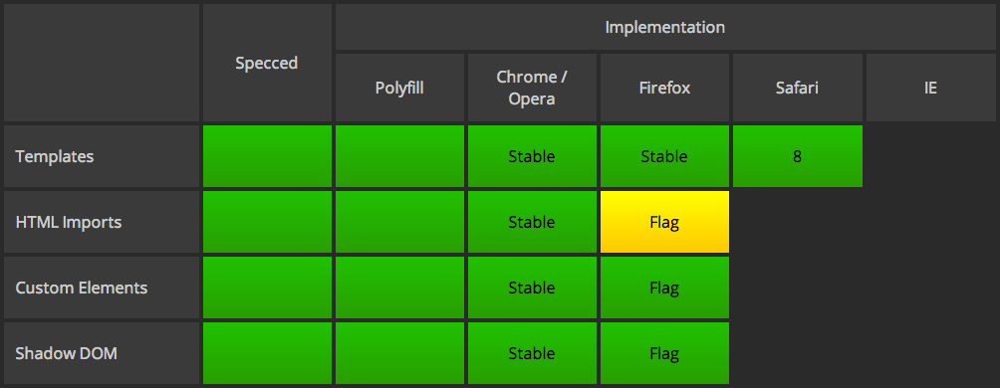

# Les nouveaux soldats du web : web components

> Dmytro Podyachiy [@dimapod79](https://twitter.com/dimapod79)
<br/>
> Benjamin Lacroix [@benjlacroix](https://twitter.com/benjlacroix)

---

# Plan de mission

* Aujourd'hui
* Réponse ciblée
* Renforts
* Règlement
* Caserne

---

# Aujourd'hui

--

## Déjà plusieurs factions

* jQuery plugins
* directives AngularJS
* Vues BackbonesJS

--

## Harmonieusement intégrées

Dépendances
```javascript
  <link rel="stylesheet" type="text/css" href="my-zooka.css" />
  <script src="my-zooka.js" />
```

Cible
```html
  <div id="my-zooka"></div>
```

Initialisation
```javascript
  new MyZooka(document.getElementById('my-zooka'));
```

--

## Composant initialisé

Domination
```html
<div id="my-zooka">
  <div class="team">Blue</div>
  <div class="name">Zooka</div>
  <div class="power">10</div>
  <div class="range">42</div>
</div>
```
Le code du plugin est partagé avec celui de la page : collisions multiples.

--

# Réponse ciblée
> ENCAPSULATION

---

# Renforts

--

## Qu'est ce qu'il manque ?

Dépendance
```javascript
<link rel="import" href="my-zooka.html"/>
```
Utilisation
```javascript
<my-zooka/>
```
Le navigateur se charge de résoudre `my-zooka` et d'encapsuler le markup dans un fragment *encapsulé*.

--

Les web components sont un ensemble de technologies :

* [Custom Element](http://www.html5rocks.com/en/tutorials/webcomponents/customelements/)
* [HTML Templates](http://www.html5rocks.com/en/tutorials/webcomponents/template/)
* [HTML Imports](http://www.html5rocks.com/en/tutorials/webcomponents/imports/)
* [Shadow DOM](http://www.html5rocks.com/en/tutorials/webcomponents/shadowdom/)


---

# Règlement

--

Depuis *juillet 2014* la [W3C](http://www.w3.org/wiki/WebComponents/) propose un début de spécification pour les web components.

--

## Tableau des compatibilités


> <span style="color: yellow">jaune</span> : en cours de développement
<br/>
> <span style="color: green">vert</span> : presque terminé

source : [are-we-componentized-yet](http://jonrimmer.github.io/are-we-componentized-yet/)

--

A partir de ces spécifications des bibliothèques permettent la compatibilité.

* [Polyfill](http://webcomponents.org/polyfills/)
* [Polymer](https://www.polymer-project.org/)
* [X-Tag](http://www.x-tags.org/)
* [Brick](http://bricksjs.com/index.html)
* [Bosonic](http://bosonic.github.io/)

---

# Caserne

---

# Custom Element

> Provide a way for Web developers to build their own, fully-featured DOM elements.
> Rationalize the platform. [W3C](http://w3c.github.io/webcomponents/spec/custom/#dfn-help-web-developers)

--

Les `Custom Elements` sont des objets dont l'interface est défini par le développeur.

Les nouveaux éléments DOM ainsi créées permettent de :

1. Définir des nouveaux éléments HTML/DOM
1. Etendre d'autres éléments ex. : [HTMLButtonElement](https://developer.mozilla.org/en/docs/Web/API/HTMLButtonElement)
1. Encapsuler des fonctionnalités sur mesure
1. Etendre l'API d'élément HTML/DOM existants

--

## Définir un nouvel élément

Doit contenir un caractère`U+002D HYPHEN-MINUS` et **ne doit pas** contenir des caractères ASCII en majuscule. [W3C](http://w3c.github.io/webcomponents/spec/custom/#dfn-custom-element-type).

Certains noms sont réservées :

* annotation-xml
* color-profile
* font-face
* font-face-src
* [...](http://w3c.github.io/webcomponents/spec/custom/#dfn-custom-element-type)

--


## Cycle de vie

1. création de l'élément avant qu'il soit enregistré
1. la définition du nouvel élément est enregistrée
1. l'instance de l'élément est créé après que la définition soit enregirstré
1. l'élément

---

# HTML Templates

---

# HTML Imports

---

# Shadow DOM

---

# Prêt pour la bataille ?

---

# Workshop

> A vous de jouer !
